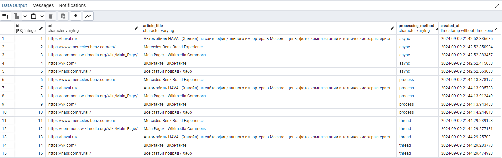

# Задание 2

Напишите программу на Python для параллельного парсинга нескольких веб-страниц с сохранением данных в базу данных с использованием подходов threading, multiprocessing и async.
Каждая программа должна парсить информацию с нескольких веб-сайтов, сохранять их в базу данных.

# База данных

Напишем удобный модуль для подключения к базе. В нём объявляется таблица Article с вспомогательными полями.

```Python title="database.py"
import datetime
from sqlmodel import Field, SQLModel, create_engine, Session
from dotenv import load_dotenv
import os

load_dotenv()

db_url = os.getenv("DB_URL")

engine = create_engine(db_url, echo=True)


def create_database_session() -> Session:
    return Session(bind=engine)


def init_db() -> None:
    SQLModel.metadata.create_all(engine)


class Article(SQLModel, table=True):
    id: int = Field(primary_key=True)
    url: str = Field(...)
    article_title: str = Field(...)
    processing_method: str = Field(...)
    created_at: datetime.datetime = Field(default_factory=datetime.datetime.now)


def add_article_to_database(processing_method: str, url: str, title: str):
    db_session = create_database_session()
    new_article = Article(
        processing_method=processing_method, url=url, article_title=title
    )

    db_session.add(new_article)
    db_session.commit()
    db_session.refresh(new_article)


init_db()
```

# async

```Python title="async_sum.py"
import asyncio
import aiohttp
from bs4 import BeautifulSoup
import time
from database import add_article_to_database


async def parse_and_save(session: aiohttp.ClientSession, url: str):
    async with session.get(url) as response:
        html = await response.text()
        parsed_html = BeautifulSoup(html, "html.parser")
        title = parsed_html.title.string
        add_article_to_database(processing_method="async", url=url, title=title)


async def main():
    urls = [
        "https://vk.com/",
        "https://commons.wikimedia.org/wiki/Main_Page/",
        "https://habr.com/ru/all/",
        "https://haval.ru/",
        "https://www.mercedes-benz.com/en/"
    ]

    async with aiohttp.ClientSession() as session:
        tasks = [parse_and_save(session, url) for url in urls]
        await asyncio.gather(*tasks)


if __name__ == "__main__":
    start_time = time.time()
    asyncio.run(main())
    end_time = time.time()
    execution_time = end_time - start_time
    print(f"Execution time: {execution_time} seconds")
```

# process

```Python title="process_sum.py"
import multiprocessing
from typing import List
import requests
from bs4 import BeautifulSoup
import time
from database import add_article_to_database


def parse_and_save(url: str):
    response = requests.get(url)
    parsed_html = BeautifulSoup(response.text, "html.parser")
    title = parsed_html.title.string
    add_article_to_database(processing_method="process", url=url, title=title)


def main():
    urls = [
        "https://vk.com/",
        "https://commons.wikimedia.org/wiki/Main_Page/",
        "https://habr.com/ru/all/",
        "https://haval.ru/",
        "https://www.mercedes-benz.com/en/"
    ]

    processes: List[multiprocessing.Process] = []

    for url in urls:
        process = multiprocessing.Process(target=parse_and_save, args=(url,))
        processes.append(process)
        process.start()

    for process in processes:
        process.join()


if __name__ == "__main__":
    start_time = time.time()
    main()
    end_time = time.time()
    execution_time = end_time - start_time
    print(f"Execution time: {execution_time} seconds")
```

# threading

```Python title="thread_sum.py"
import threading
from typing import List
import requests
from bs4 import BeautifulSoup
import time
from database import add_article_to_database


def parse_and_save(url: str):
    response = requests.get(url)
    soup = BeautifulSoup(response.text, "html.parser")
    title = soup.title.string
    add_article_to_database(processing_method="thread", url=url, title=title)


def main():
    urls = [
        "https://vk.com/",
        "https://commons.wikimedia.org/wiki/Main_Page/",
        "https://habr.com/ru/all/",
        "https://haval.ru/",
        "https://www.mercedes-benz.com/en/"
    ]

    threads: List[threading.Thread] = []

    for url in urls:
        thread = threading.Thread(target=parse_and_save, args=(url,))
        threads.append(thread)
        thread.start()

    for thread in threads:
        thread.join()


if __name__ == "__main__":
    start_time = time.time()
    main()
    end_time = time.time()
    execution_time = end_time - start_time
    print(f"Execution time: {execution_time} seconds")
```

# Результаты и вывод

| Метод       | Время                   |
| ----------- | ----------------------- |
| `async`     | Execution time: 0.3577542304992676 seconds |
| `process`   | Execution time: 1.0995142459869385 seconds |
| `thread`    | Execution time: 0.3405771255493164 seconds |



При парсинге более большого объема сайтов метод `multiprocessing` всё-таки должен выйграть, так как всем остальным либо не хватит ресурсов, либо не хватит скорости. На таком маленьком количестве сайтов побеждает опять чуть ли не синхронный вариант парсинга.